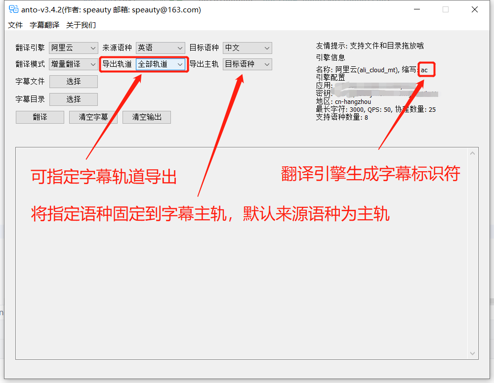
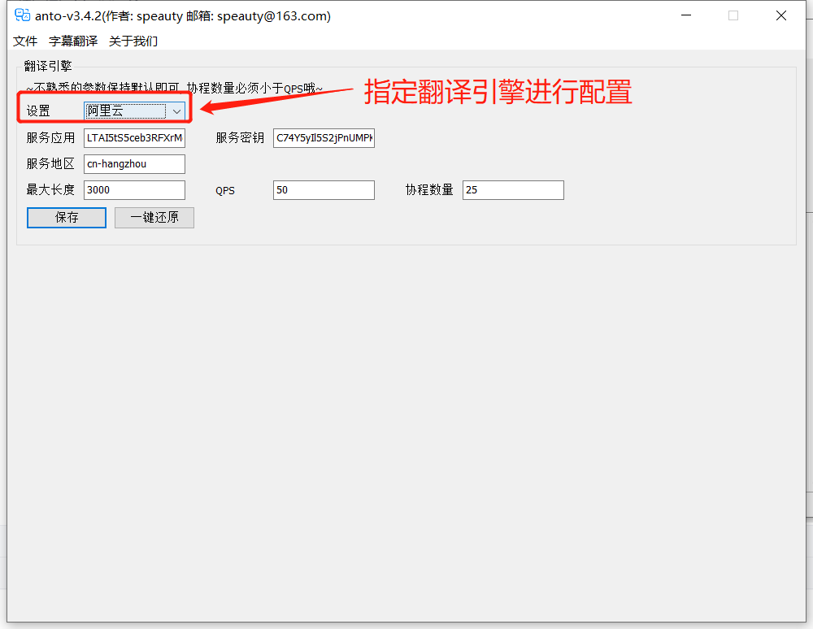

## ANTO-不专业字幕翻译的Windows桌面应用

> 作为一名临时搬运工，搞个字幕翻译工具，一点也不过分~是吧
>


### 写在前面

我是21年底才接触到油管搬运。不知出于什么原因，看了UP主[@神经元猫](https://space.bilibili.com/364152971/?spm_id_from=333.999.0.0)搬运翻译的[Cherno C++ 中文](https://space.bilibili.com/364152971/channel/collectiondetail?sid=13909)，感觉[TheCherno](https://github.com/TheCherno)挺有趣的，就萌生了搬运他的OpenGL教程，然后就是游戏引擎等。刚开始，特别费人，使用剪映的智能字幕进行音频识别并导出SRT字幕。

由于分段很乱，需要人工调整，然后挨个翻译。遇到陌生单词，还要去查一下。但是吧，后来觉得效率低得令人发指。既然有智能字幕，那么就有智能翻译，然后，就了解到了各种机器翻译。看着每月的免费额度，完全可以操作一下。那么，就开始着手这款应用的研发。并不复杂，初版几天就搞定了，主要还是对框架不太熟悉，而且有些场景不太了解，大多都是后面慢慢完善。

用，是能用了，但是，应该还有很大提升的空间。比如，有朋友提到的AI翻译，以及通知和托盘等。

加油~


### 框架目录

主要采用`lxn/walk`框架实现的，受限于框架仅支持Windows，最近试过用`fyne`重写，其实主要功能都写完了，但是，有很多小问题，还是弃了。以下是项目的整体目录（可能有变动）：

```shell
├─.idea 	# Goland的项目记录，已忽略                     
├─.run  	# Goland的Run/Debug配置，其中包含一个运行的配置，我日常开发使用的
├─bin   	# 编译目录，已忽略                     
│  ├─assets	# 依赖的静态资源目录
│  └─logs	# 运行日志目录
├─bootstrap	# 一些初始化安装实现目录
├─cfg		# 配置目录，采用spf13/viper加载yml配置文件（默认是可执行文件同级目录下的cfg.yml）
├─common 	# 公共目录，现在放了一些数据结构定义
├─cron		# 内置任务
│  ├─detector 	# SRT检测
│  ├─reader 	# SRT读取
│  ├─translate 	# SRT翻译
│  └─writer 	# SRT写入
├─dependency 	# 依赖目录
│  ├─repository # 服务管理仓库
│  └─service 	# 依赖的服务
│      └─translator 			# 翻译服务
│          ├─ali_cloud_mt    	# 阿里云翻译
│          ├─baidu 				# 百度翻译
│          ├─caiyunai       	# 彩云小译 
│          ├─deepl 				# DeepL翻译
│          ├─huawei_cloud_nlp 	# 华为云翻译
│          ├─ling_va 			# LingVA翻译
│          ├─niutrans 			# 小牛翻译
│          ├─openapi_youdao 	# 有道智云翻译
│          ├─tencent_cloud_mt 	# 腾讯云翻译
│          └─youdao 			# 有道翻译
├─lib 		# 核心库
│  ├─log 	# 日志类实现, 二次包装zap
│  ├─nohup 	# 常驻进程模拟
│  ├─srt 	# SRT解析等
│  └─util 	# 工具函数
└─platform 		# 平台
    └─win 		# windows
        ├─page 	# 页面
        └─ui 	# UI包装
            ├─handle 	# 操作包装
            ├─msg 		# 弹窗
            └─pack 		# 组件包装
```


### 任务列表

- [x] 集成lxn/walk桌面GUI库（才把fyne清理了，那个编译运行太慢了，而且Win下，依赖环境有点。。。），这个要抽一波，不然用起来，小难受；
- [x] 实现静态界面（还是不大会多窗口模式，估计会照旧采用Widget的显示来模拟多页面，也可能还是单页）；
  - [x] 常用配置本地缓存（文件），就我最近的使用体验来看，不想再输密钥了；
  - [x] 增加全量和增量翻译模式区分，防止重复翻译，浪费资源；
  - [x] 增加批量翻译模式（挂机，一直跑），那个列表有点小烦，后面没有单独放置操作的列；
- [x] 实现srt文件解析和压缩（这块好搞，我感觉都写了好几次了）；
- [x] 接入上游翻译服务（如果有什么好的免费的服务，也可以给我说）；

### 应用预览





